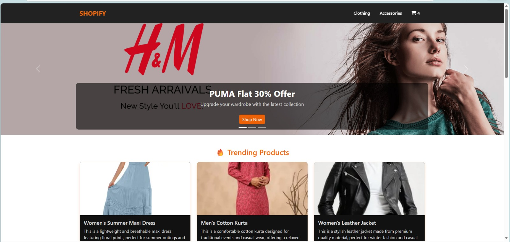
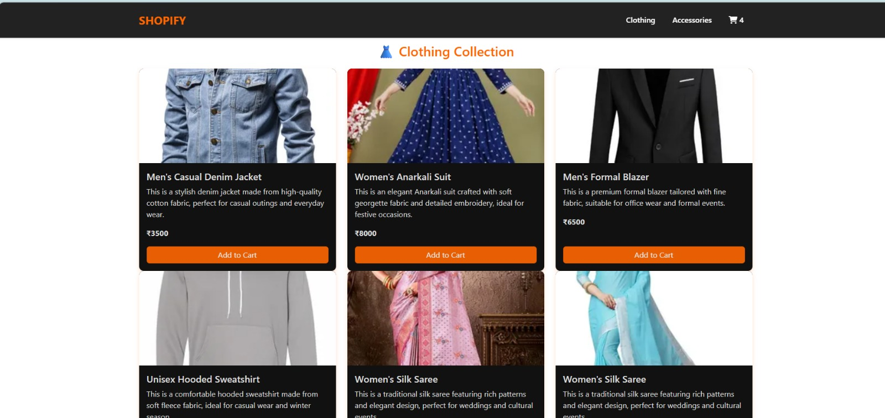
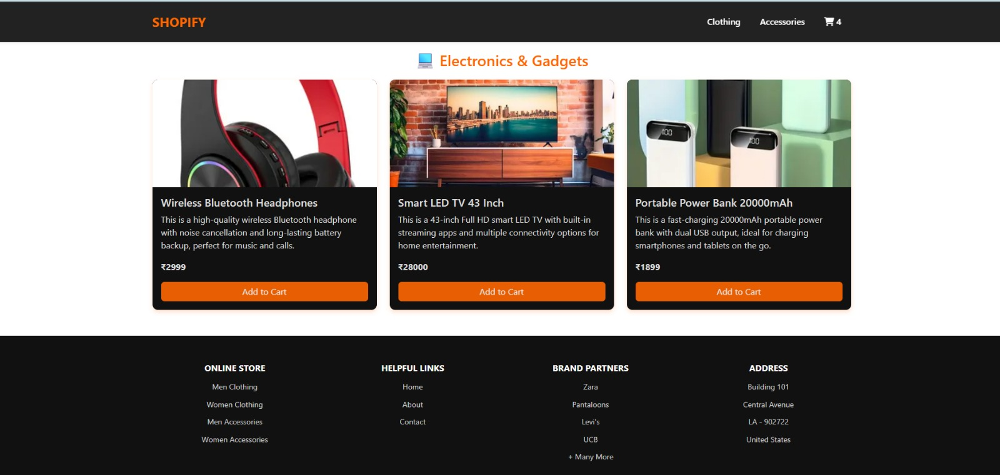
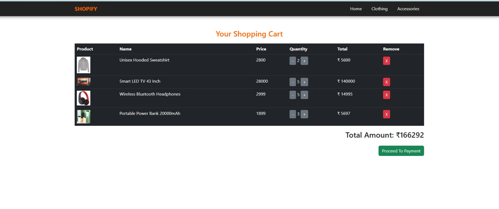

<h1>🛒 E-Commerce Application (Spring Boot)</h1>
<h4>A backend E-Commerce REST API built using Spring Boot, Spring Data JPA, and MySQL.
This application allows users to manage products, customers, and orders through RESTful APIs following a layered architecture.</h4>
<h2>🚀 Features</h2>
<b>
<or>
<li>User management (Create, update, view users)</li>
<li>Product management (Add, update, delete, list products)</li>
<li>Order management system</li>
<li>Multiple order items per order</li>
<li>RESTful API design</li>
<li>Layered architecture implementation</li>
<li>Database integration with MySQL</li>
</or>
</b>
 <h2> Tech Stack </h2>
<b>Java | Spring Boot | Spring Data JPA | REST API | Maven | MySQL </b> 

## ScreenShots
   
   
   
   

# That's all 🎊🎉  
